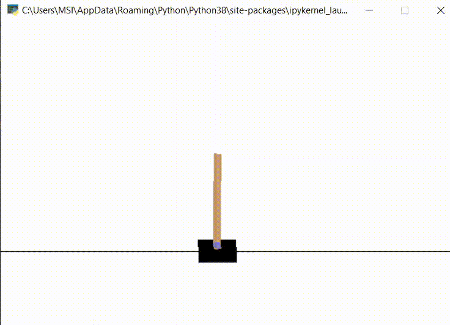

# Reinforce-PPO
This is a repository containing REINFORCE and PPO algorithms implemented using Pytorch
## Use REINFORCE and PPO for the Cartpole v-0 env

### Requirements installation
First Download or clone the repository.
Then pip install requirements.txt using
```` 
pip install -r requirements.txt
```` 
### For REINFORCE
Go into the jupyter notebook and run it all
### REINFORCE Results


### For PPO
Navigate into the ppo folder and run the jupyter notebook train.ipynb
PS: the actor and critic networks are already trained in the repository. you can skip the training and see the execution right away.
### PPO results


### Execution on Cartpole v-0
Here is an example of the REINFORCE algorithm.

